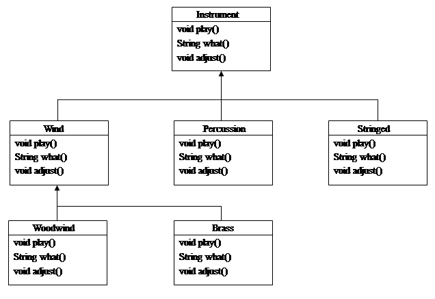
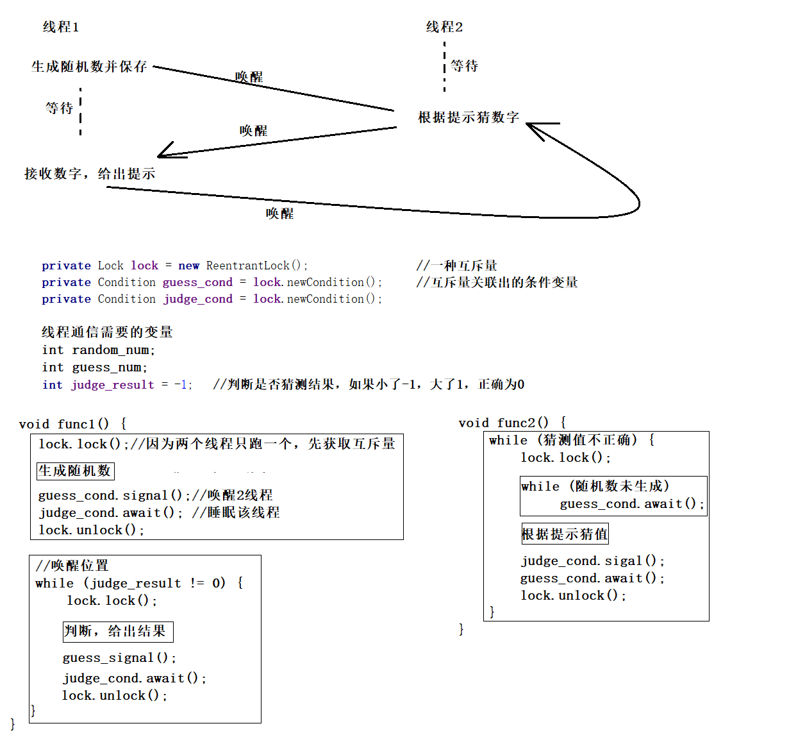
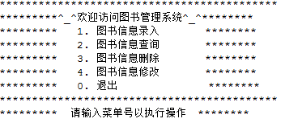
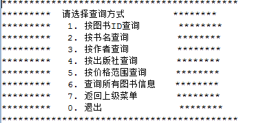

##### 第一部分、小程序练习

1. 随机产生30个不超过1000的随机数，计算每一个随机数各数位的数字之和，并且输出各数位之和大于6的随机数。要求为计算数位和及输出设计一个方法。

2. 设计一个学生成绩管理系统，能输入若干个学生的学号、姓名和三科成绩（数学，语文，英语）数据，要求：

   （1）计算每个学生的总成绩，并按总成绩从高到低对学生进行排序，将排序的结果输出。

   （2）输入姓名查询成绩。

3. 产品属性：产品号（number）、种类（category）、名称（name）、价格（price ）

   计算机Computer除具有产品基本信息外，还可能具有下面的属性：内存（memory）、处理器（processorName） 

   笔记本电脑Laptop 除具有产品基本信息外，还可能具有下面的属性：厚度（thickness）、重量（weight）

   根据以上信息，首先抽象出类Product，它派生出子类Computer，Computer又派生出它的子类Laptop，实现以上三个类的定义，定义相应的构造方法，声明一个测试类，生成类对象，并把打印结果显示在屏幕上。

4. 超市具有收银功能，但是对于不同的顾客会有区别，普通顾客正常收费，会员收费会打九折，内部员工打八折。

   设计程序，利用在超市类的收费方法里使用抽象类customer的上转型对象作为参数，实现对不同的顾客按照不同的折扣进行收费。

5. 设计一个录入和显示学生基本信息的程序界面，学生信息包括学号、姓名、性别、专业（只能是软件工程、网络工程、物联网）、成绩。当用户输入完毕，点击保存按钮时，弹出消息对话框，提示“保存成功”。如果成绩是负数或者大于100，则弹出警告对话框“输入成绩无效！”。设计者根据需要选取合适的组件完成设计。（使用GUI完成）

6. 编写程序，统计一个文本文件中的字符（包括空格）数、单词数和行的数目。

   

7. 针对如图所示的类和接口层次，从面向对象的角度，用合理的方式编写能完成图示功能的程序，并再编写一个简单的应用程序，进行多态性测试。

   说明：Instrument表示乐器，Wind表示管乐器，Percussion表示敲击乐器，Stringed表示弦乐器，Woodwind表示木管乐器，Brass表示铜管乐器。

   （1）将上述乐器都定义成类，怎样实现？

   （2）将Instrument定义成抽象类，应怎样实现？

   （3）将Instrument定义成接口，应怎样实现？

8. 用两个线程玩猜数字游戏，第一个线程负责随机给出1到100之间的一个整数，第二 个线程负责猜出这个数。要求每当第二个线程给出自己的猜测后，第一个线程都会提示“猜大了”，“猜小了”或“猜对了”。猜数之前，要求第二个线程要等待第一个线程设置好要猜测的数。第一个线程设置好猜测数之后，两个线程还要互相等待，其原则是：第二个线程给出自己的猜测后，等待第一个线程给出的提示：第一个线程给出提示后，等待给第二个线程给出猜测，如此进行，直到第二个线程给出正确的猜测后，两个线程进入死亡状态。

   

   ```
   private Lock lock = new ReentrantLock();	//互斥量
   private Condition guess_cond = lock.newCondition();	//条件变量
   private Condition judge_cond = lock.newCondition();
   
   void func1() {
   	lock.lock();//因为两个线程只跑一个，先获取互斥量
   	生成随机数
   	guess_cond.signal();
   	judge_cond.await();
   	lock.unlock();
   	
   	//唤醒位置
   	lock.lock();
   	判断，给出结果
   	guess_cond.signal();
   	judge_cond.await();
   	lock.unlock();
   }
   
   void func2() {
   	while (猜测值不正确) {
   		lock.lock();
   		
   		while (随机数未生成) {
   			guess_cond.await();
   		}
   		
   		根据提示猜值
   		judge_cond.signal();
   		guess_cond.await();
   		lock.unlock();
   	}
   }
   ```

9. 某银行账户A上有金额m元。甲持卡取出c元，乙用存折存入q元，假设二人在不同 地方同时对A账户执行操作，要求编写线程实现存钱、取钱功能，要求存取务必准确。

   ```
   （1）继承线程Thread类，实现重写run()方法
   （2）定义类实现Runnable接口，重写run()方法，将此类对象作为参数构造Thread对象
   （3）具体方法作为参数构造Thread对象
   ```

10. 将java1.txt的全部内容写入java2.txt。（要求分别用非缓冲区方式和缓存区方式完成）

11. 编写程序，利用身份证号分析身份信息，要求输出此人省份、年龄、属相、星座、性别等信息。（使用GUI完成）

    几种添加事件处理：

    （1）定义监听器类实现监听器接口(太麻烦，接口下方法太多，不是所有都用到，还要都实现)

    （2）继承适配器类，用什么方法重写什么

    （3）直接用匿名内部类，`btn.addMouseListener(new MouseAdapter() {@Override 方法})`（一般用这个）

12. 编写一个应用程序，要求如下：

    窗口中有一个TexField对象和一个按钮对象，将这两个对象添加到一个面板中，然后将该面板添加到窗口的上面。用户在TexField对象中输入一个英文单词，然后按Enter键或单击“确定”按钮，程序将创建若干个不可编辑的文本框，每个文本框随机显示英文单词的一个字母。要求将这些文本框按一行添加到一个面板中，然后将该面板添加到窗口的中心。用户用鼠标单击一个文本框后，通过按下键盘上的“—>”和“ß--”键交换相邻文本框中的字母，使得这些文本框中的字母排列顺序和英文单词中字母的顺序相同。

##### 第二部分、小型软件的开发（选做一题，且由个人独立开发完成）

**课程设计题目**

1. 编写一个记事本程序。

   要求：使用图形用户界面实现。能实现编辑、保存、另存为、查询替换等功能。

2. 模拟计算器程序。

   要求：界面模拟Windows中计算器程序。实现基本数学运算加、减、乘和除等功能。

3. 编写图书管理系统。

   要求：可参照以下形式完成系统功能。

   
   
   
